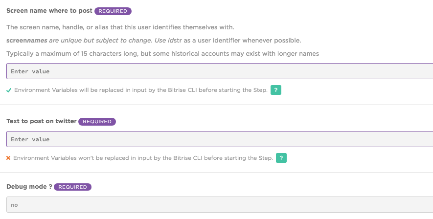

# twitter-message step

This step update a twitter status account.

## How to use this Step

This step is using twitter API. You have to create a twitter application [here](https://apps.twitter.com/) to obtain all necessary information to post a message.

This step update a twitter account status link with the twitter app.

For that you need some information from your twitter app
* Consumer Key (API Key)
* Consumer Secret (API Secret)
* Access Token
* Access Token Secret

## Inputs variables

## Example

## Dependencies

The nodejs script in this step is using npm twitter your can find [here](https://www.npmjs.com/package/twitter).

## Credit

